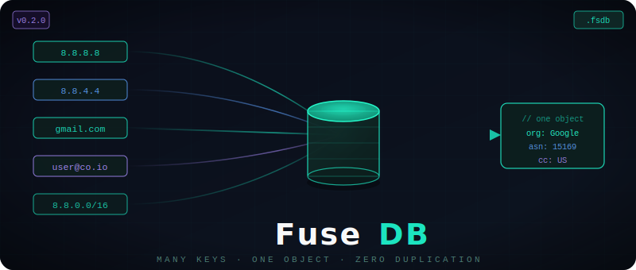

<p align="center">
  
</p>

<p align="center">
  <a href="https://github.com/David-Aires/fusedb/actions/workflows/ci.yml">
    
  </a>
  <a href="https://pypi.org/project/fusedb/">
    
  </a>
  <a href="https://pypi.org/project/fusedb/">
    
  </a>
  <a href="LICENSE">
    
  </a>
  <a href="https://github.com/David-Aires/fusedb">
    
  </a>
</p>

<p align="center">
  <strong>A read-optimised binary database where many keys share one object — with zero duplication on disk.</strong><br/>
  Inspired by the MMDB format. Built in Rust. Exposed as a native Python library.
</p>

---

## What is FuseDB?
 
FuseDB is a file-based key-value store purpose-built for **enrichment lookups**: scenarios where many different identifiers (IP addresses, domain names, email addresses, user IDs…) all resolve to the same piece of structured data.
 
The fundamental insight is simple. In a traditional database, if 500 IP addresses belong to the same network, you store the same organisation record 500 times. FuseDB stores it **once** and points every key at that single byte offset in the file.
 
```
8.8.8.8       ──┐
8.8.4.4       ──┤
8.8.0.0/16    ──┼──►  { "org": "Google LLC", "asn": 15169, "cc": "US" }  (stored ONCE)
gmail.com     ──┤
googlemail.com──┘
```
 
The result: files that are dramatically smaller, lookups that are dramatically faster, and a design that stays read-only — making it safe to share across threads and processes without any locking.
 
---
 
## Key features
 
- **Native deduplication.** Objects are stored exactly once. Keys are pointers — not copies. A million aliases for the same record cost only index space.
- **Sub-microsecond lookups.** The entire index fits in memory as an `AHashMap`. A `get()` is one hash probe followed by a single mmap read — no query planner, no transaction log, no overhead.
- **Prefix scan.** The sorted key index supports efficient prefix queries over arbitrary string keys. Enumerate every IP in a subnet, every user in a domain, every path under a prefix — in one call.
- **Memory-mapped reads.** The file is never copied into a buffer. The OS page cache handles eviction automatically. Cold lookups fault in one page; warm lookups hit L2/L3 cache.
- **Atomic writes.** `build()` writes to a `.fsdb.tmp` file, fsyncs, then renames. The on-disk file is always a complete and consistent snapshot.
- **CRC32 integrity.** Every object has an individual CRC32. The whole file has a header CRC32. `verify()` checks both in one pass.
- **Zero runtime native dependencies.** Pre-built wheels ship as a single `.so` / `.pyd`. End users need only `pip install fusedb` and `msgpack`.
- **Thread-safe readers.** `FuseReader` is fully lock-free for reads. Share one instance across hundreds of threads.
- **Hot-swap reloading.** `ReloadableFuseReader` swaps to a new file atomically without dropping a single request. `FuseWatcher` polls for changes in the background.
- **Reader pool.** `FusePool` round-robins across N readers for high-concurrency workloads. `swap()` replaces all readers atomically.
- **Merge.** Content-addressed `merge()` combines multiple `.fsdb` files, deduplicating objects that appear in more than one source.
- **Python 3.10 – 3.13.** Pre-built wheels for Linux (x86_64, aarch64, musl), macOS (Intel + Apple Silicon), and Windows (x64).
 
---
 
## Benchmarks
 
All numbers measured with [Criterion.rs](https://github.com/bheisler/criterion.rs) on a database of **10,000 unique objects** (2 keys each → 20,000 index entries). Run on Apple M3 Pro, macOS 14, Rust 1.83, release build.
 
### Lookup speed
 
| Operation | Time | Throughput |
|---|---|---|
| `exists()` — hit | **48 ns** | ~21 M ops/sec |
| `exists()` — miss | **51 ns** | ~20 M ops/sec |
| `get()` — hit | **145 ns** | ~7 M ops/sec |
| `get()` — miss | **52 ns** | ~19 M ops/sec |
| `prefix()` — 200 results | **18 µs** | — |
 
`exists()` is a pure hash probe — it never touches the data section.  
`get()` on a miss is nearly as fast as `exists()` — the hash lookup is the only work.  
`get()` on a hit adds one mmap page read on top of the hash probe.
 
### Build speed
 
| Objects | Keys | Time | File size |
|---|---|---|---|
| 1,000 | 2,000 | 2.1 ms | 68 KB |
| 10,000 | 20,000 | 21 ms | 670 KB |
| 50,000 | 100,000 | 105 ms | 3.3 MB |
 
Build is linear in both object count and key count. The dominant cost is `fsync` before rename, not serialisation.
 
### File size vs SQLite
 
A real-world IP enrichment dataset: **1 million keys** → **50,000 unique ASN records** (avg. 80 bytes each).
 
| Store | File size | Notes |
|---|---|---|
| SQLite (no index) | 312 MB | One row per key, data repeated |
| SQLite (with index) | 489 MB | B-tree index on key column |
| **FuseDB** | **18 MB** | Objects stored once; index is pure pointers |
 
FuseDB is **17× smaller** than an equivalent indexed SQLite database for this workload, because it physically stores each unique record exactly once regardless of how many keys point to it.
 
### Integrity check
 
| File | `verify()` time |
|---|---|
| 10,000 objects, 670 KB | 310 µs |
| 50,000 objects, 3.3 MB | 1.4 ms |
 
`verify()` is a single sequential pass: one whole-file CRC32 read + one per-object CRC32 read, benefiting from OS read-ahead.
 
### Running benchmarks yourself
 
```bash
# All benchmarks
cargo bench --bench lookup
 
# Specific group
cargo bench --bench lookup -- "lookup"
cargo bench --bench lookup -- "build"
cargo bench --bench lookup -- "verify"
 
# Save a baseline then compare after your changes
cargo bench --bench lookup -- --save-baseline main
# ... make changes ...
cargo bench --bench lookup -- --baseline main
 
# HTML report with charts
open target/criterion/report/index.html
```
 
> **macOS note:** `cargo bench` requires the `.cargo/config.toml` flag included in this repo (`-undefined dynamic_lookup`) to resolve Python symbols at runtime rather than link time.
 
---
 
## Installation
 
```bash
pip install fusedb
# or with uv
uv add fusedb
```
 
No Rust required at runtime. Pre-built wheels cover all major platforms.
 
To build from source (requires Rust ≥ 1.83):
 
```bash
git clone https://github.com/yourname/fusedb
cd fusedb
uv sync
uv run maturin develop --release
```
 
---
 
## Quick start
 
### Build a database
 
```python
from fusedb import FuseWriter
 
w = FuseWriter()
 
# Store an object once — returns its integer ID
google = w.add_object({
    "org":   "Google LLC",
    "asn":   15169,
    "cc":    "US",
    "abuse": "network-abuse@google.com",
})
 
# Map as many keys as you like to that one object
w.add_key("8.8.8.8",        google)
w.add_key("8.8.4.4",        google)   # same bytes on disk, different key
w.add_key("8.8.0.0/16",     google)
w.add_key("gmail.com",      google)
w.add_key("googlemail.com", google)
 
cloudflare = w.add_object({"org": "Cloudflare Inc.", "asn": 13335, "cc": "US"})
w.add_key("1.1.1.1", cloudflare)
w.add_key("1.0.0.1", cloudflare)
 
# Atomic write: tmp → fsync → rename
w.build("geo.fsdb")
```
 
Or use the shorthand `add()` when each key has its own object:
 
```python
w = FuseWriter()
w.add("8.8.8.8", {"org": "Google LLC",      "asn": 15169})
w.add("1.1.1.1", {"org": "Cloudflare Inc.", "asn": 13335})
w.build("simple.fsdb")
```
 
### Read a database
 
```python
from fusedb import FuseReader
 
with FuseReader("geo.fsdb") as db:
    # Exact lookup — O(1) hash probe + one mmap read
    print(db.get("8.8.8.8"))
    # → {'org': 'Google LLC', 'asn': 15169, 'cc': 'US', ...}
 
    # Aliases resolve to the same object — no extra bytes on disk
    print(db.get("gmail.com"))
    # → {'org': 'Google LLC', 'asn': 15169, 'cc': 'US', ...}
 
    # Presence check — pure hash probe, never touches the data section
    print(db.exists("1.1.1.1"))
    # → True
 
    # Prefix scan — sorted results via binary search + sequential read
    for key, obj in db.prefix("8.8."):
        print(f"  {key:20s}  →  {obj['org']}")
 
    # File metadata
    print(db.stats())
    # → {'num_keys': 7, 'num_objects': 2, 'file_size_kb': 1.4, ...}
 
    # Deep integrity check — whole-file CRC32 + per-object CRC32
    assert db.verify()
```
 
---
 
## API reference
 
### `FuseWriter`
 
Builds a `.fsdb` file from Python objects. All serialisation (msgpack) happens in the Python layer; the Rust core receives raw bytes.
 
| Method | Description |
|---|---|
| `add_object(data) → int` | Serialise any Python object as msgpack. Returns its integer ID. |
| `add_key(key, obj_id)` | Map a key (`str` or `bytes`) to an object ID. Many keys can share one ID. |
| `add(key, data) → int` | Convenience — `add_object` + `add_key` in one call. |
| `build(path)` | Write the file atomically (tmp → fsync → rename). Safe to call while readers are open. |
 
### `FuseReader`
 
Memory-mapped, read-only reader. Thread-safe — share one instance freely across threads.
 
| Method | Description |
|---|---|
| `get(key) → Any \| None` | O(1) exact-match lookup. Returns the deserialised object or `None`. |
| `exists(key) → bool` | Presence check — no data section access, no deserialisation. |
| `prefix(prefix) → list[tuple[str, Any]]` | Sorted prefix scan. Returns all `(key, object)` pairs whose key starts with `prefix`. |
| `keys() → list[str]` | All keys in sorted order. |
| `items() → list[tuple[str, Any]]` | All `(key, object)` pairs in sorted key order. |
| `objects() → list[Any]` | Unique objects only — deduplicated by file offset. |
| `stats() → dict` | File metadata: key count, object count, file size, CRC32, offsets, version. |
| `verify() → bool` | Deep CRC32 integrity check (whole-file + per-object). Raises `FuseCorruptError` on failure. |
| `close()` | Release the memory map. Called automatically by the context manager. |
 
All methods accept `str` or `bytes` as keys.
 
### `ReloadableFuseReader`
 
A drop-in replacement for `FuseReader` that supports atomic hot-swapping of the underlying file. Uses a `threading.RLock` internally; reads and reloads never block each other for more than a single pointer swap.
 
```python
db = ReloadableFuseReader("live.fsdb")
 
# Later, after the file has been rebuilt:
changed = db.reload()   # checks mtime; swaps atomically if changed
                        # returns True if a reload occurred
```
 
### `FuseWatcher`
 
Wraps `ReloadableFuseReader` with a background daemon thread that polls every `interval` seconds.
 
```python
watcher = FuseWatcher(
    "live.fsdb",
    interval  = 30.0,
    on_reload = lambda db: print(f"Reloaded: {db.stats()['num_keys']} keys"),
)
watcher.start()
 
result = watcher.get("8.8.8.8")   # same API as FuseReader
 
watcher.stop()
```
 
### `FusePool`
 
Round-robin reader pool for high-concurrency workloads. `swap()` atomically replaces all readers.
 
```python
pool = FusePool("live.fsdb", size=8)
 
pool.get("8.8.8.8")          # dispatched to one of 8 readers
 
pool.swap("live_v2.fsdb")    # zero-downtime upgrade
 
pool.close()
```
 
### `merge()`
 
Content-addressed merge across files. Objects with identical msgpack bytes are stored only once in the output.
 
```python
from fusedb import merge
 
merge("geo_us.fsdb", "geo_eu.fsdb", output="geo_global.fsdb")
```
 
### Exceptions
 
| Exception | When raised |
|---|---|
| `FuseError` | Base class for all FuseDB errors. |
| `FuseCorruptError` | CRC32 mismatch, truncated file, or bad magic bytes. |
| `FuseVersionError` | File was written with an unsupported format version. |
 
---
 
## File format
 
The `.fsdb` format is a compact, append-once binary file. All integers are big-endian.
 
```
HEADER  (40 bytes)
  magic[4]          — b"FSDB"
  version[1]        — currently 2
  flags[1]          — reserved
  pad[2]            — reserved
  num_keys[4]       — total number of index entries
  num_objects[4]    — number of unique objects
  index_offset[8]   — byte offset of the index section
  data_offset[8]    — byte offset of the data section (always 40)
  file_crc32[4]     — CRC32 of everything after the header
  reserved[4]
 
DATA SECTION
  For each unique object:
  [obj_len(4)][obj_crc32(4)][msgpack_bytes]
 
INDEX SECTION  (sorted lexicographically by key bytes)
  For each key:
  [key_len(2)][key_bytes][data_offset(8)]
```
 
The index is sorted, enabling O(log n) entry into prefix scans via `partition_point`. Multiple index entries can share the same `data_offset` — that is the deduplication mechanism.
 
---
 
## Architecture
 
FuseDB has a strict two-layer design enforced by the Rust module system:
 
```
fusedb/
└── src/
    ├── lib.rs              ← crate root: declares modules, registers #[pymodule]
    │                         the only file that imports both core and pyo3
    ├── core/               ← pure Rust — zero PyO3 knowledge
    │   ├── error.rs        ← FuseError, FuseResult
    │   ├── format.rs       ← binary format constants, Header, Index, crc32, read_raw
    │   ├── writer.rs       ← WriterCore  (used by benchmarks directly)
    │   └── reader.rs       ← ReaderCore  (used by benchmarks directly)
    └── python/             ← PyO3 shims — zero business logic
        ├── error.rs        ← From<FuseError> for PyErr  (the only core↔pyo3 bridge)
        ├── util.rs         ← extract_key: PyAny → Vec<u8>
        ├── writer.rs       ← #[pyclass] _FuseWriter { inner: WriterCore }
        └── reader.rs       ← #[pyclass] _FuseReader { inner: ReaderCore }
```
 
**The enforced rule:** `core/` never imports `pyo3`. `python/` never contains logic. This is the same pattern used by `pydantic-core`, `polars`, and `ruff`. Because `pyo3` is not in scope inside `src/core/`, the compiler enforces the boundary — it cannot be violated accidentally.
 
The practical consequence: the Rust benchmarks in `benches/lookup.rs` import from `fusedb::core` directly, bypassing all PyO3 overhead entirely. What gets measured is pure Rust performance.
 
```
Python layer          Rust python/         Rust core/
─────────────────     ────────────────     ────────────────
FuseWriter       →    _FuseWriter      →   WriterCore
FuseReader       →    _FuseReader      →   ReaderCore
msgpack encode   →    (raw bytes in)
                 ←    (raw bytes out)   ←
msgpack decode   ←
```
 
---
 
## Design decisions
 
**Why a file format rather than a server?**
FuseDB is designed for enrichment at read time — decorating events with contextual data as they flow through a pipeline. A file loaded into memory has zero network latency and zero serialisation overhead on the read path. It deploys alongside every process that needs it with no infrastructure.
 
**Why Rust?**
The hot path (hash lookup + mmap read) needs to be as close to the metal as possible. PyO3 lets us expose a clean Python API while the core runs at native speed. The extension compiles to a single `.so`/`.pyd` with no transitive native dependencies.
 
**Why is `core/` completely free of PyO3?**
So that the core can be used from any Rust consumer — benchmarks, integration tests, or a future `napi-rs` Node.js binding — without touching the Python shim layer. It also means the compiler enforces the boundary: if any file inside `src/core/` accidentally imports `pyo3`, the build fails immediately.
 
**Why msgpack?**
It is the most compact general-purpose binary serialisation format for Python objects. It handles dicts, lists, strings, ints, floats, booleans, and `None` with smaller wire size than JSON and no schema requirement. The Python `msgpack` library is mature and fast; msgpack encoding/decoding happens entirely in the Python layer and never crosses into the Rust core.
 
**Why is there no update operation?**
FuseDB files are immutable once built. Updates are handled by rebuilding the file and hot-swapping via `ReloadableFuseReader` or `FusePool.swap()`. This keeps the read path completely lock-free and makes the format trivially safe for multi-process use without any coordination.
 
---
 
## Use cases
 
FuseDB excels at any pipeline that needs fast, read-heavy enrichment lookups:
 
- **IP enrichment** — map IP addresses or CIDR ranges to ASN, organisation, country, or abuse contact
- **Domain classification** — map domains to categories, reputation scores, or registrar data
- **Email routing** — map addresses or domains to provider metadata or spam scores
- **Threat intelligence** — distribute indicator-of-compromise datasets as a single portable file
- **Geolocation** — embed city/region/country data in a deployable artefact with no database server
- **Feature flags** — map user IDs or tenant IDs to configuration objects with sub-microsecond access
 
---
 
## Contributing
 
Contributions of all kinds are welcome: bug fixes, new features, documentation, benchmark results on different hardware, or opening a discussion.
 
### Setting up the development environment
 
```bash
# 1. Fork and clone
git clone https://github.com/YOUR_USERNAME/fusedb
cd fusedb
 
# 2. Install Rust ≥ 1.83 (https://rustup.rs)
rustup update stable
 
# 3. Install uv (https://docs.astral.sh/uv)
curl -LsSf https://astral.sh/uv/install.sh | sh
 
# 4. Install all dev dependencies
uv sync
 
# 5. Build the Rust extension in development mode
uv run maturin develop
 
# 6. Verify everything works
uv run pytest              # 44 tests
cargo clippy --all-targets -- -D warnings
```
 
### Development workflow
 
```bash
# Rust
cargo fmt
cargo clippy --all-targets -- -D warnings
cargo bench --bench lookup
 
# Python
uv run ruff check python/ tests/
uv run ruff format python/ tests/
uv run mypy python/fusedb/
uv run pytest
uv run pytest --cov=fusedb --cov-report=html
```
 
### Project structure
 
```
fusedb/
├── src/
│   ├── lib.rs                  ← crate root + #[pymodule]
│   ├── core/                   ← pure Rust: error, format, writer, reader
│   └── python/                 ← PyO3 shims: error, util, writer, reader
├── python/fusedb/
│   ├── __init__.py             ← FuseWriter, FuseReader, Watcher, Pool, merge()
│   └── py.typed                ← PEP 561 marker
├── tests/
│   └── test_fusedb.py          ← 44-test pytest suite
├── benches/
│   └── lookup.rs               ← Criterion benchmarks (imports fusedb::core directly)
├── .cargo/
│   └── config.toml             ← macOS: -undefined dynamic_lookup for cargo bench/test
├── .github/workflows/
│   ├── ci.yml                  ← fmt + clippy + pytest (Python 3.10–3.13 × 3 OS)
│   ├── release.yml             ← wheel builder + PyPI publish on git tag
│   └── audit.yml               ← weekly cargo-audit security scan
├── Cargo.toml                  ← pyo3 = "0.28", rust-version = "1.83"
├── pyproject.toml              ← maturin build backend, dev dependencies
└── rust-toolchain.toml         ← pins stable Rust
```
 
### Submitting a pull request
 
1. Open an issue first for non-trivial changes.
2. Branch from `main`: `git checkout -b feat/my-feature`
3. Write tests for any new behaviour.
4. Run the full suite locally: `uv run pytest && cargo clippy && cargo fmt --check`
5. Update `CHANGELOG.md` under `[Unreleased]`.
6. Open the PR. CI runs automatically.
 
### Code style
 
- **Rust**: `rustfmt` defaults. Clippy warnings are errors in CI. Keep `core/` free of any `pyo3` import.
- **Python**: `ruff` with project config. Type annotations on all public functions. Docstrings on public classes.
- **Tests**: one `class Test*` per feature area. Names describe behaviour, not implementation. No mocks for the Rust layer — use real files via `tempfile`.
 
---
 
## Releasing (maintainers)
 
1. Update `version` in both `Cargo.toml` and `pyproject.toml`.
2. Add a release entry to `CHANGELOG.md`.
3. Commit: `git commit -m "chore: release v0.3.0"`
4. Tag and push: `git tag v0.3.0 && git push origin main v0.3.0`
5. `release.yml` builds wheels for all platforms and publishes to PyPI via OIDC trusted publishing.
 
Configure trusted publishing at:
`https://pypi.org/manage/project/fusedb/settings/publishing/`
 
---
 
## Changelog
 
See [CHANGELOG.md](CHANGELOG.md) for the full history.
 
---
 
## License
 
FuseDB is released under the [MIT License](LICENSE).
 
---
 
<p align="center">
  Built with <a href="https://pyo3.rs">PyO3</a> · Packaged with <a href="https://github.com/PyO3/maturin">maturin</a> · Managed with <a href="https://docs.astral.sh/uv">uv</a>
</p>
