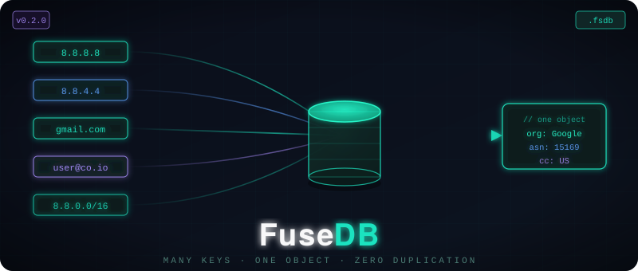

<p align="center">
  
</p>

<p align="center">
  <a href="https://github.com/David-Aires/fusedb/actions/workflows/ci.yml">
    
  </a>
  <a href="https://pypi.org/project/fusedb/">
    
  </a>
  <a href="https://pypi.org/project/fusedb/">
    
  </a>
  <a href="https://crates.io/crates/fusedb">
    
  </a>
  <a href="https://docs.rs/fusedb">
    
  </a>
  <a href="LICENSE">
    
  </a>
</p>

<p align="center">
  <strong>A read-optimised binary database where many keys share one object — with zero duplication on disk.</strong><br/>
  Inspired by the MMDB format. Built in Rust. First-class libraries for <strong>Rust</strong> and <strong>Python</strong>, over one shared file format.
</p>

---

## What is FuseDB?
 
FuseDB is a file-based key-value store purpose-built for **enrichment lookups**: scenarios where many different identifiers (IP addresses, domain names, email addresses, user IDs…) all resolve to the same piece of structured data.
 
The fundamental insight is simple. In a traditional database, if 500 IP addresses belong to the same network, you store the same organisation record 500 times. FuseDB stores it **once** and points every key at that single byte offset in the file.
 
```
8.8.8.8       ──┐
8.8.4.4       ──┤
8.8.0.0/16    ──┼──►  { "org": "Google LLC", "asn": 15169, "cc": "US" }  (stored ONCE)
gmail.com     ──┤
googlemail.com──┘
```
 
The result: files that are dramatically smaller, lookups that are dramatically faster, and a design that stays read-only — making it safe to share across threads and processes without any locking.
 
---
 
## One format, two languages
 
There is no "Rust format" and no "Python format". There is only **the FuseDB format** — every implementation is another way to produce and consume it.
 
```bash
cargo add fusedb     # Rust
pip install fusedb   # Python
```
 
Write in one, read in the other. No conversion step, no export, no compatibility flag:
 
```python
# Python writes
from fusedb import FuseWriter
 
w = FuseWriter()
w.add("google.com", {"company": "Google"})
w.build("db.fsdb")
```
 
```rust
// Rust reads the very same file
use fusedb::FuseReader;
use std::collections::BTreeMap;
 
let db = FuseReader::open("db.fsdb")?;
let hit: Option<BTreeMap<String, String>> = db.get("google.com")?;
assert_eq!(hit.unwrap()["company"], "Google");
```
 
…and in the other direction:
 
```rust
// Rust writes
use fusedb::FuseWriter;
use std::collections::BTreeMap;
 
let mut w = FuseWriter::new();
let mut value = BTreeMap::new();
value.insert("company", "Cloudflare");
w.add("cloudflare.com", &value)?;
w.build("db.fsdb")?;
```
 
```python
# Python reads
from fusedb import FuseReader
 
db = FuseReader("db.fsdb")
print(db.get("cloudflare.com"))   # {'company': 'Cloudflare'}
```
 
Both sides share the same magic bytes and format version, the same CRC32 placement and validation, the same MessagePack value encoding, the same sorted index layout, and the same object-deduplication rules. A [cross-language test suite](tests/interop.rs) runs on every CI build and even asserts that `merge()` produces **byte-identical** output in both languages — so a format regression fails the build rather than reaching a registry.
 
---
 
## Key features
 
- **Native deduplication.** Objects are stored exactly once. Keys are pointers — not copies. A million aliases for the same record cost only index space.
- **Sub-microsecond lookups.** The entire index fits in memory as an `AHashMap`. A `get()` is one hash probe followed by a single mmap read — no query planner, no transaction log, no overhead.
- **Prefix scan.** The sorted key index supports efficient prefix queries over arbitrary string keys. Enumerate every IP in a subnet, every user in a domain, every path under a prefix — in one call.
- **Memory-mapped reads.** The file is never copied into a buffer. The OS page cache handles eviction automatically. Cold lookups fault in one page; warm lookups hit L2/L3 cache.
- **Atomic writes.** `build()` writes to a `.fsdb.tmp` file, fsyncs, then renames. The on-disk file is always a complete and consistent snapshot.
- **CRC32 integrity.** Every object has an individual CRC32. The whole file has a header CRC32. `verify()` checks both in one pass.
- **Zero runtime native dependencies.** Pre-built wheels ship as a single `.so` / `.pyd`. End users need only `pip install fusedb` and `msgpack`.
- **Thread-safe readers.** `FuseReader` is fully lock-free for reads. Share one instance across hundreds of threads.
- **Hot-swap reloading.** Swap to a rebuilt file atomically without dropping a single request — `ReloadableFuseReader` / `FuseWatcher` in Python, `ReloadableReader` / `FuseWatcher` in Rust.
- **Reader pool.** `FusePool` round-robins across N readers for high-concurrency workloads. `swap()` replaces all readers atomically.
- **Merge.** Content-addressed `merge()` combines multiple `.fsdb` files, deduplicating objects that appear in more than one source.
- **Native in both languages.** `cargo add fusedb` gets an idiomatic Rust crate with no PyO3 in its dependency graph; `pip install fusedb` gets the Python package. Same files, either direction.
- **Python 3.10 – 3.13.** Pre-built wheels for Linux (x86_64, aarch64, musl), macOS (Intel + Apple Silicon), and Windows (x64).
 
---
 
## Benchmarks
 
All numbers measured with [Criterion.rs](https://github.com/bheisler/criterion.rs) on a database of **10,000 unique objects** (2 keys each → 20,000 index entries). Run on Apple M3 Pro, macOS 14, Rust 1.83, release build.
 
### Lookup speed
 
| Operation | Time | Throughput |
|---|---|---|
| `exists()` — hit | **48 ns** | ~21 M ops/sec |
| `exists()` — miss | **51 ns** | ~20 M ops/sec |
| `get()` — hit | **145 ns** | ~7 M ops/sec |
| `get()` — miss | **52 ns** | ~19 M ops/sec |
| `prefix()` — 200 results | **18 µs** | — |
 
`exists()` is a pure hash probe — it never touches the data section.  
`get()` on a miss is nearly as fast as `exists()` — the hash lookup is the only work.  
`get()` on a hit adds one mmap page read on top of the hash probe.
 
### Build speed
 
| Objects | Keys | Time | File size |
|---|---|---|---|
| 1,000 | 2,000 | 2.1 ms | 68 KB |
| 10,000 | 20,000 | 21 ms | 670 KB |
| 50,000 | 100,000 | 105 ms | 3.3 MB |
 
Build is linear in both object count and key count. The dominant cost is `fsync` before rename, not serialisation.
 
### File size vs SQLite
 
A real-world IP enrichment dataset: **1 million keys** → **50,000 unique ASN records** (avg. 80 bytes each).
 
| Store | File size | Notes |
|---|---|---|
| SQLite (no index) | 312 MB | One row per key, data repeated |
| SQLite (with index) | 489 MB | B-tree index on key column |
| **FuseDB** | **18 MB** | Objects stored once; index is pure pointers |
 
FuseDB is **17× smaller** than an equivalent indexed SQLite database for this workload, because it physically stores each unique record exactly once regardless of how many keys point to it.
 
### Integrity check
 
| File | `verify()` time |
|---|---|
| 10,000 objects, 670 KB | 310 µs |
| 50,000 objects, 3.3 MB | 1.4 ms |
 
`verify()` is a single sequential pass: one whole-file CRC32 read + one per-object CRC32 read, benefiting from OS read-ahead.
 
### Running benchmarks yourself
 
```bash
# All benchmarks
cargo bench --bench lookup
 
# Specific group
cargo bench --bench lookup -- "lookup"
cargo bench --bench lookup -- "build"
cargo bench --bench lookup -- "verify"
 
# Save a baseline then compare after your changes
cargo bench --bench lookup -- --save-baseline main
# ... make changes ...
cargo bench --bench lookup -- --baseline main
 
# HTML report with charts
open target/criterion/report/index.html
```
 
> **macOS note:** `cargo bench` requires the `.cargo/config.toml` flag included in this repo (`-undefined dynamic_lookup`) to resolve Python symbols at runtime rather than link time.
 
---
 
## Installation
 
### Python
 
```bash
pip install fusedb
# or with uv
uv add fusedb
```
 
No Rust required at runtime. Pre-built wheels cover all major platforms.
 
### Rust
 
```bash
cargo add fusedb
```
 
The crate is standalone — PyO3 sits behind a `python` feature that only maturin enables, so a Rust build never pulls it in.
 
```toml
[dependencies]
fusedb = "0.3"

# Raw bytes only, no serde — bring your own serialisation.
# Note that files written this way are readable by the Python
# package only if the payloads you store are MessagePack.
fusedb = { version = "0.3", default-features = false }
```
 
| Feature | Default | What it adds |
|---|---|---|
| `msgpack` | ✅ | The typed `add()` / `get::<T>()` API, encoding values exactly the way the Python package does. |
| `python` | — | PyO3 bindings. Enabled by maturin when building the wheel; Rust consumers never need it. |
 
### From source
 
Requires Rust ≥ 1.83:
 
```bash
git clone https://github.com/yourname/fusedb
cd fusedb
uv sync
uv run maturin develop --release
```
 
---
 
## Quick start
 
<sub>Python below; jump to [Quick start (Rust)](#quick-start-rust) for the crate.</sub>
 
### Build a database
 
```python
from fusedb import FuseWriter
 
w = FuseWriter()
 
# Store an object once — returns its integer ID
google = w.add_object({
    "org":   "Google LLC",
    "asn":   15169,
    "cc":    "US",
    "abuse": "network-abuse@google.com",
})
 
# Map as many keys as you like to that one object
w.add_key("8.8.8.8",        google)
w.add_key("8.8.4.4",        google)   # same bytes on disk, different key
w.add_key("8.8.0.0/16",     google)
w.add_key("gmail.com",      google)
w.add_key("googlemail.com", google)
 
cloudflare = w.add_object({"org": "Cloudflare Inc.", "asn": 13335, "cc": "US"})
w.add_key("1.1.1.1", cloudflare)
w.add_key("1.0.0.1", cloudflare)
 
# Atomic write: tmp → fsync → rename
w.build("geo.fsdb")
```
 
Or use the shorthand `add()` when each key has its own object:
 
```python
w = FuseWriter()
w.add("8.8.8.8", {"org": "Google LLC",      "asn": 15169})
w.add("1.1.1.1", {"org": "Cloudflare Inc.", "asn": 13335})
w.build("simple.fsdb")
```
 
### Read a database
 
```python
from fusedb import FuseReader
 
with FuseReader("geo.fsdb") as db:
    # Exact lookup — O(1) hash probe + one mmap read
    print(db.get("8.8.8.8"))
    # → {'org': 'Google LLC', 'asn': 15169, 'cc': 'US', ...}
 
    # Aliases resolve to the same object — no extra bytes on disk
    print(db.get("gmail.com"))
    # → {'org': 'Google LLC', 'asn': 15169, 'cc': 'US', ...}
 
    # Presence check — pure hash probe, never touches the data section
    print(db.exists("1.1.1.1"))
    # → True
 
    # Prefix scan — sorted results via binary search + sequential read
    for key, obj in db.prefix("8.8."):
        print(f"  {key:20s}  →  {obj['org']}")
 
    # File metadata
    print(db.stats())
    # → {'num_keys': 7, 'num_objects': 2, 'file_size_kb': 1.4, ...}
 
    # Deep integrity check — whole-file CRC32 + per-object CRC32
    assert db.verify()
```
 
---
 
## Quick start (Rust)
 
The Rust API does not mimic the Python one — it is idiomatic Rust, and produces identical `.fsdb` files. Runnable versions of everything below live in [`examples/`](examples/):
 
```bash
cargo run --example quickstart
cargo run --example interop
```
 
### Build a database
 
```rust
use fusedb::FuseWriter;
use serde::Serialize;
 
#[derive(Serialize)]
struct Org<'a> {
    org: &'a str,
    asn: u32,
    cc: &'a str,
}
 
let mut w = FuseWriter::new();
 
// Store an object once — returns its object ID
let google = w.add_object(&Org { org: "Google LLC", asn: 15169, cc: "US" })?;
 
// Map as many keys as you like to that one object
w.add_key("8.8.8.8", google)?;
w.add_key("8.8.4.4", google)?;      // same bytes on disk, different key
w.add_key("gmail.com", google)?;
 
// add() is add_object + add_key in one step
w.add("1.1.1.1", &Org { org: "Cloudflare Inc.", asn: 13335, cc: "US" })?;
 
// Atomic write: tmp → fsync → rename
let report = w.build("geo.fsdb")?;
println!("{} objects · {} keys", report.num_objects, report.num_keys);
```
 
### Read a database
 
```rust
use fusedb::FuseReader;
use serde::Deserialize;
 
#[derive(Deserialize, Debug)]
struct Org { org: String, asn: u32, cc: String }
 
let db = FuseReader::open("geo.fsdb")?;   // verifies the whole-file CRC32
 
// Exact lookup — O(1) hash probe + one mmap read
let hit: Option<Org> = db.get("8.8.8.8")?;
 
// Presence check — never touches the data section
assert!(db.exists("1.1.1.1"));
 
// Lazy, sorted prefix scan — objects are read as the iterator reaches them
for entry in db.prefix_iter("8.8.") {
    let (key, raw) = entry?;
    println!("{key} → {} bytes", raw.len());
}
 
// File metadata
let stats = db.stats();
println!("{} keys over {} objects", stats.num_keys, stats.num_objects);
 
// Deep integrity check — whole-file CRC32 + per-object CRC32
db.verify()?;
```
 
### Merge
 
```rust
fusedb::merge(&["geo_us.fsdb", "geo_eu.fsdb"], "geo_global.fsdb")?;
```
 
### Hot-swap a live database
 
`.fsdb` files are immutable once built, so an update means rebuilding and swapping. `ReloadableReader` does the swap when you ask; `FuseWatcher` does it from a background thread.
 
```rust
use std::time::Duration;
use fusedb::FuseWatcher;
 
let watcher = FuseWatcher::builder("live.fsdb")
    .interval(Duration::from_secs(30))
    .on_reload(|db| eprintln!("reloaded: {} keys", db.len()))
    // A rebuild caught halfway through fails its CRC check; the previous
    // snapshot keeps serving and the next poll picks up the finished file.
    .on_error(|e| eprintln!("reload failed, still serving the old file: {e}"))
    .spawn()?;
 
// Read it like a FuseReader. Every call resolves the current file, so reads
// follow the background swap on their own — no reload bookkeeping.
println!("{:?}", watcher.get::<Org>("8.8.8.8")?);
println!("{}", watcher.exists("1.1.1.1"));
println!("{} keys", watcher.len());
 
// Share it across threads; the same read surface is on ReloadableReader.
let reader = std::sync::Arc::clone(watcher.reader());
std::thread::spawn(move || reader.exists("1.1.1.1"));
 
// Dropping the watcher stops and joins the thread. stop() is the explicit form.
watcher.stop();
```
 
Without a background thread, drive the swap yourself — the reads are identical:
 
```rust
use fusedb::ReloadableReader;
 
let db = ReloadableReader::open("live.fsdb")?;
if db.reload_if_changed()? {
    println!("swapped to generation {}", db.generation());
}
println!("{:?}", db.get::<Org>("8.8.8.8")?);
```
 
### Snapshots
 
Each read above resolves the current reader once — cheap (a read lock plus an `Arc` clone, ~2 ns against a ~145 ns `get()`), but not free. For a batch, resolve once with `load()` and reuse it:
 
```rust
let db = watcher.load();                 // Arc<FuseReader>
for key in ["8.8.8.8", "8.8.4.4", "1.1.1.1"] {
    println!("{:?}", db.get_raw(key)?);
}
```
 
A snapshot is also a *stable* view: it keeps its own memory mapping, so a swap partway through a multi-step read cannot make the results inconsistent, and a request in flight is never interrupted. The flip side is that a snapshot stored long-term never sees a swap and pins the old mapping in memory — take one per request or per batch, not per process. That trade-off is exactly why the direct methods exist and why `load()` is opt-in.
 
See [`examples/watch.rs`](examples/watch.rs) for four reader threads serving lookups across four live rebuilds.
 
This is the Rust counterpart to Python's `ReloadableFuseReader` and `FuseWatcher`. Reads behave the same — Python resolves `self._db` under a lock on every call, which is what these methods do too — with two deliberate differences: the Rust version never writes to stdout (failures go to `on_error`), and its polling thread is stopped and joined on drop rather than living on as a daemon.
 
> **Polling, not filesystem events.** No platform-specific dependency, and a good fit for files rebuilt on a schedule. For sub-second reaction, drive `ReloadableReader::reload_if_changed()` from your own [`notify`](https://crates.io/crates/notify) watcher — the swap machinery is the same.
 
---
 
## Rust API reference
 
Full documentation on [docs.rs/fusedb](https://docs.rs/fusedb).
 
### `FuseWriter`
 
| Method | Description |
|---|---|
| `new()` | Create an empty writer. |
| `add_object(&value)` | Serialise `value` to MessagePack, store it as a new object, return its ID. |
| `add_object_deduped(&value)` | As above, but reuse an existing object when the encoded bytes match. |
| `add_key(key, obj_id)` | Point `key` at an existing object. Any `AsRef<[u8]>` works. |
| `add(key, &value)` | `add_object` + `add_key` in one call. |
| `add_object_raw(bytes)` / `add_object_raw_deduped(bytes)` | Store pre-encoded bytes, no serde involved. |
| `add_raw(key, bytes)` | `add_object_raw` + `add_key`. |
| `build(path)` | Atomic write; returns a `BuildReport { num_objects, num_keys, file_size }`. |
| `num_objects()` / `num_keys()` / `is_empty()` | Staging counters. |
 
`add_object` always appends, matching Python's `FuseWriter` exactly, so the same call sequence yields the same file in either language. Reach for the `*_deduped` variants when you want identical payloads collapsed.
 
### `FuseReader`
 
| Method | Description |
|---|---|
| `open(path)` | Memory-map the file and validate its CRC32. |
| `open_unverified(path)` | Skip the CRC pass — for trusted or already-verified files. |
| `get::<T>(key)` | O(1) lookup, decoded into `T`. |
| `get_raw(key)` | O(1) lookup, raw stored bytes. |
| `exists(key)` | Presence check against the in-memory index. |
| `prefix_iter(prefix)` | Lazy sorted prefix scan yielding `(key, raw_bytes)`. |
| `prefix::<T>(prefix)` | Eager sorted prefix scan, values decoded into `T`. |
| `keys()` / `keys_raw()` | All keys, sorted — decoded or as bytes. |
| `items::<T>()` / `items_raw()` | Every `(key, value)` pair in sorted key order. |
| `objects::<T>()` / `objects_raw()` | Unique objects only, deduplicated by offset. |
| `len()` / `is_empty()` | Key count. |
| `stats()` | `Stats { path, version, num_keys, num_objects, index_offset, data_offset, file_size, file_crc32 }`. |
| `verify()` / `is_valid()` | Deep CRC32 check — erroring or boolean. |
 
`FuseReader` is lock-free for reads. Share one behind an `Arc` across as many threads as you like.
 
### `ReloadableReader` and `FuseWatcher`
 
Both carry the same read surface, and every method on it resolves the current file:
 
| Method | Description |
|---|---|
| `get::<T>(key)` / `get_raw(key)` | O(1) lookup against the newest build. |
| `exists(key)` | Presence check. |
| `prefix::<T>(prefix)` / `prefix_raw(prefix)` | Sorted prefix scan. |
| `keys()` / `keys_raw()` | All keys, sorted. |
| `items::<T>()` / `items_raw()` | Every `(key, value)` pair. |
| `objects::<T>()` / `objects_raw()` | Unique objects only. |
| `len()` / `is_empty()` | Key count. |
| `stats()` | File metadata. |
| `verify()` / `is_valid()` | Deep CRC32 check. |
| `load()` | Snapshot as an `Arc<FuseReader>`, for batching or a stable view. |
 
`prefix_iter()` is the one method with no direct form — the iterator borrows its reader, so take a snapshot: `db.load().prefix_iter(..)`.
 
Swap control, on `ReloadableReader`:
 
| Method | Description |
|---|---|
| `open(path)` / `open_unverified(path)` | Open, with or without CRC32 validation on every load. |
| `reload_if_changed()` | Swap if modification time or length moved. `Ok(true)` when swapped. |
| `reload()` | Swap unconditionally — for rewrites that land inside one timestamp tick. |
| `generation()` | Successful swaps so far. Useful as a cache-invalidation token. |
| `path()` / `verifies()` | Configuration readback. |
 
Thread control, on `FuseWatcher`:
 
| Method | Description |
|---|---|
| `builder(path)` | Start configuring: `.interval()`, `.verify()`, `.on_reload()`, `.on_error()`, `.spawn()`. |
| `spawn(path, interval)` | Shorthand for a watcher with no callbacks. |
| `reader()` | The `Arc<ReloadableReader>`, for sharing across threads. |
| `reload_now()` | Check immediately instead of waiting for the next poll. |
| `stop()` | Stop and join the polling thread. `Drop` does the same. |
 
### Free functions
 
| Function | Description |
|---|---|
| `merge(&sources, output)` | Content-addressed merge. Byte-identical to Python's `merge()`. |
| `merge_into(&mut writer, source)` | Fold one file into a live writer, so you can merge and add in one pass. |
| `encode(&value)` / `decode::<T>(bytes)` | The MessagePack codec both languages share. |
 
### Errors
 
Everything returns `FuseResult<T> = Result<T, FuseError>`:
 
| Variant | When returned |
|---|---|
| `FuseError::Corrupt` | CRC32 mismatch, truncated file, or bad magic bytes. |
| `FuseError::Version` | File written with an unsupported format version. |
| `FuseError::Io` | Open, read, write, rename, or fsync failure. |
| `FuseError::InvalidArg` | Unknown object ID, or a key longer than `MAX_KEY_LEN`. |
| `FuseError::Serialization` | A value could not be encoded to or decoded from MessagePack. |
 
### Lower-level access
 
`fusedb::core` exposes the raw format engine — `ReaderCore`, `WriterCore`, header constants, `crc32`. Use it when you want to drive the format directly without the ergonomics layer, as [`benches/lookup.rs`](benches/lookup.rs) does.
 
---
 
## Python API reference
 
### `FuseWriter`
 
Builds a `.fsdb` file from Python objects. All serialisation (msgpack) happens in the Python layer; the Rust core receives raw bytes.
 
| Method | Description |
|---|---|
| `add_object(data) → int` | Serialise any Python object as msgpack. Returns its integer ID. |
| `add_key(key, obj_id)` | Map a key (`str` or `bytes`) to an object ID. Many keys can share one ID. |
| `add(key, data) → int` | Convenience — `add_object` + `add_key` in one call. |
| `build(path)` | Write the file atomically (tmp → fsync → rename). Safe to call while readers are open. |
 
### `FuseReader`
 
Memory-mapped, read-only reader. Thread-safe — share one instance freely across threads.
 
| Method | Description |
|---|---|
| `get(key) → Any \| None` | O(1) exact-match lookup. Returns the deserialised object or `None`. |
| `exists(key) → bool` | Presence check — no data section access, no deserialisation. |
| `prefix(prefix) → list[tuple[str, Any]]` | Sorted prefix scan. Returns all `(key, object)` pairs whose key starts with `prefix`. |
| `keys() → list[str]` | All keys in sorted order. |
| `items() → list[tuple[str, Any]]` | All `(key, object)` pairs in sorted key order. |
| `objects() → list[Any]` | Unique objects only — deduplicated by file offset. |
| `stats() → dict` | File metadata: key count, object count, file size, CRC32, offsets, version. |
| `verify() → bool` | Deep CRC32 integrity check (whole-file + per-object). Raises `FuseCorruptError` on failure. |
| `close()` | Release the memory map. Called automatically by the context manager. |
 
All methods accept `str` or `bytes` as keys.
 
### `ReloadableFuseReader`
 
A drop-in replacement for `FuseReader` that supports atomic hot-swapping of the underlying file. Uses a `threading.RLock` internally; reads and reloads never block each other for more than a single pointer swap.
 
```python
db = ReloadableFuseReader("live.fsdb")
 
# Later, after the file has been rebuilt:
changed = db.reload()   # checks mtime; swaps atomically if changed
                        # returns True if a reload occurred
```
 
### `FuseWatcher`
 
Wraps `ReloadableFuseReader` with a background daemon thread that polls every `interval` seconds.
 
```python
watcher = FuseWatcher(
    "live.fsdb",
    interval  = 30.0,
    on_reload = lambda db: print(f"Reloaded: {db.stats()['num_keys']} keys"),
)
watcher.start()
 
result = watcher.get("8.8.8.8")   # same API as FuseReader
 
watcher.stop()
```
 
### `FusePool`
 
Round-robin reader pool for high-concurrency workloads. `swap()` atomically replaces all readers.
 
```python
pool = FusePool("live.fsdb", size=8)
 
pool.get("8.8.8.8")          # dispatched to one of 8 readers
 
pool.swap("live_v2.fsdb")    # zero-downtime upgrade
 
pool.close()
```
 
### `merge()`
 
Content-addressed merge across files. Objects with identical msgpack bytes are stored only once in the output.
 
```python
from fusedb import merge
 
merge("geo_us.fsdb", "geo_eu.fsdb", output="geo_global.fsdb")
```
 
### Exceptions
 
| Exception | When raised |
|---|---|
| `FuseError` | Base class for all FuseDB errors. |
| `FuseCorruptError` | CRC32 mismatch, truncated file, or bad magic bytes. |
| `FuseVersionError` | File was written with an unsupported format version. |
 
---
 
## File format
 
The `.fsdb` format is a compact, append-once binary file. All integers are big-endian.
 
```
HEADER  (40 bytes)
  magic[4]          — b"FSDB"
  version[1]        — currently 2
  flags[1]          — reserved
  pad[2]            — reserved
  num_keys[4]       — total number of index entries
  num_objects[4]    — number of unique objects
  index_offset[8]   — byte offset of the index section
  data_offset[8]    — byte offset of the data section (always 40)
  file_crc32[4]     — CRC32 of everything after the header
  reserved[4]
 
DATA SECTION
  For each unique object:
  [obj_len(4)][obj_crc32(4)][msgpack_bytes]
 
INDEX SECTION  (sorted lexicographically by key bytes)
  For each key:
  [key_len(2)][key_bytes][data_offset(8)]
```
 
The index is sorted, enabling O(log n) entry into prefix scans via `partition_point`. Multiple index entries can share the same `data_offset` — that is the deduplication mechanism.
 
---
 
## Architecture
 
FuseDB has a strict three-layer design enforced by the Rust module system:
 
```
fusedb/
└── src/
    ├── lib.rs              ← crate root: module declarations, public re-exports,
    │                         and the #[pymodule] entry point (feature-gated)
    ├── core/               ← format engine — raw bytes, zero PyO3 knowledge
    │   ├── error.rs        ← FuseError, FuseResult
    │   ├── format.rs       ← binary format constants, Header, Index, crc32, read_raw
    │   ├── writer.rs       ← WriterCore, BuildReport
    │   └── reader.rs       ← ReaderCore
    ├── api/                ← the public Rust API — what `cargo add fusedb` gives you
    │   ├── writer.rs       ← FuseWriter   (generic keys, typed values)
    │   ├── reader.rs       ← FuseReader, PrefixIter
    │   ├── merge.rs        ← merge, merge_into
    │   ├── watch.rs        ← ReloadableReader, FuseWatcher (hot-swap)
    │   ├── codec.rs        ← encode / decode — the msgpack shared with Python
    │   └── stats.rs        ← Stats
    └── python/             ← PyO3 shims — zero business logic, feature `python`
        ├── error.rs        ← From<FuseError> for PyErr  (the only core↔pyo3 bridge)
        ├── util.rs         ← extract_key: PyAny → Vec<u8>
        ├── writer.rs       ← #[pyclass] _FuseWriter { inner: WriterCore }
        └── reader.rs       ← #[pyclass] _FuseReader { inner: ReaderCore }
```
 
**The enforced rule:** `core/` and `api/` never import `pyo3`. `python/` never contains logic. This is the same pattern used by `pydantic-core`, `polars`, and `ruff`. Because `pyo3` is not in scope inside `src/core/` or `src/api/`, the compiler enforces the boundary — it cannot be violated accidentally.
 
`pyo3` is an *optional* dependency gated behind the `python` feature, which only maturin enables. CI fails the build if PyO3 ever appears in the default dependency graph, so a Rust consumer's `cargo build` can never end up compiling a Python extension.
 
Both language bindings sit at the same depth, over the same engine:
 
```
Python layer          Rust python/         Rust core/          Rust api/
─────────────────     ────────────────     ──────────────      ─────────────────
FuseWriter       →    _FuseWriter      →   WriterCore     ←    FuseWriter
FuseReader       →    _FuseReader      →   ReaderCore     ←    FuseReader
msgpack encode   →    (raw bytes in)                      ←    api::codec::encode
                 ←    (raw bytes out)   ←                 →    api::codec::decode
msgpack decode   ←
```
 
Neither side is a wrapper around the other. Both encode the same MessagePack and drive the same format engine, which is why their output is interchangeable.
 
---
 
## Design decisions
 
**Why a file format rather than a server?**
FuseDB is designed for enrichment at read time — decorating events with contextual data as they flow through a pipeline. A file loaded into memory has zero network latency and zero serialisation overhead on the read path. It deploys alongside every process that needs it with no infrastructure.
 
**Why Rust?**
The hot path (hash lookup + mmap read) needs to be as close to the metal as possible. PyO3 lets us expose a clean Python API while the core runs at native speed. The extension compiles to a single `.so`/`.pyd` with no transitive native dependencies.
 
**Why is `core/` completely free of PyO3?**
So that the core can be used from any Rust consumer — benchmarks, integration tests, or a future `napi-rs` Node.js binding — without touching the Python shim layer. It also means the compiler enforces the boundary: if any file inside `src/core/` accidentally imports `pyo3`, the build fails immediately. Shipping the standalone crate was mostly a matter of publishing what this boundary already made possible.
 
**Why msgpack?**
It is the most compact general-purpose binary serialisation format for structured records. It handles maps, lists, strings, ints, floats, booleans, and null with smaller wire size than JSON and no schema requirement. It is also the reason cross-language reads need no conversion: Python encodes with `msgpack.packb(..., use_bin_type=True)` and Rust with `rmp_serde::to_vec_named`, which agree byte for byte — a CI test asserts exactly that.
 
**Why doesn't the Rust API mirror the Python one?**
Because mirroring an API is not what makes files compatible — agreeing on the *format* is. The Rust side takes `AsRef<Path>` and `AsRef<[u8]>`, returns `Result`, and offers a lazy prefix iterator, none of which have Python equivalents. What the two share is the byte layout, and that is enforced by tests rather than by API symmetry.
 
**Why does `add_object` not deduplicate by default?**
So that the same sequence of calls produces the same file in both languages. Implicit deduplication would make Rust output diverge from Python's for identical inputs. `add_object_deduped` is there when you want it, and `merge()` always content-addresses.
 
**Why is there no update operation?**
FuseDB files are immutable once built. Updates are handled by rebuilding the file and hot-swapping via `ReloadableFuseReader` or `FusePool.swap()`. This keeps the read path completely lock-free and makes the format trivially safe for multi-process use without any coordination.
 
---
 
## Use cases
 
FuseDB excels at any pipeline that needs fast, read-heavy enrichment lookups:
 
- **IP enrichment** — map IP addresses or CIDR ranges to ASN, organisation, country, or abuse contact
- **Domain classification** — map domains to categories, reputation scores, or registrar data
- **Email routing** — map addresses or domains to provider metadata or spam scores
- **Threat intelligence** — distribute indicator-of-compromise datasets as a single portable file
- **Geolocation** — embed city/region/country data in a deployable artefact with no database server
- **Feature flags** — map user IDs or tenant IDs to configuration objects with sub-microsecond access
 
---
 
## Contributing
 
Contributions of all kinds are welcome: bug fixes, new features, documentation, benchmark results on different hardware, or opening a discussion.
 
### Setting up the development environment
 
```bash
# 1. Fork and clone
git clone https://github.com/YOUR_USERNAME/fusedb
cd fusedb
 
# 2. Install Rust ≥ 1.83 (https://rustup.rs)
rustup update stable
 
# 3. Install uv (https://docs.astral.sh/uv)
curl -LsSf https://astral.sh/uv/install.sh | sh
 
# 4. Install all dev dependencies
uv sync
 
# 5. Build the Rust extension in development mode
uv run maturin develop
 
# 6. Verify everything works
uv run pytest              # 44 tests
cargo clippy --all-targets -- -D warnings
```
 
### Development workflow
 
```bash
# Rust
cargo fmt
cargo clippy --all-targets -- -D warnings
cargo test --lib --test rust_api --test watch
cargo bench --bench lookup
 
# Python
uv run ruff check python/ tests/
uv run ruff format python/ tests/
uv run mypy python/fusedb/
uv run pytest
uv run pytest --cov=fusedb --cov-report=html
 
# Cross-language — needs the extension built first
uv run maturin build --out dist/ && uv pip install --force-reinstall --no-deps dist/*.whl
FUSEDB_REQUIRE_INTEROP=1 cargo test --test interop
```
 
The interop tests skip themselves when the Python package is not importable. `FUSEDB_REQUIRE_INTEROP=1` turns that skip into a failure — CI sets it so a broken environment can never produce a silent green run. Set `FUSEDB_PYTHON` to point at a specific interpreter.
 
### Project structure
 
```
fusedb/
├── src/
│   ├── lib.rs                  ← crate root, public re-exports, #[pymodule]
│   ├── core/                   ← format engine: error, format, writer, reader
│   ├── api/                    ← public Rust API: writer, reader, merge, codec, stats
│   └── python/                 ← PyO3 shims: error, util, writer, reader
├── python/fusedb/
│   ├── __init__.py             ← FuseWriter, FuseReader, Watcher, Pool, merge()
│   └── py.typed                ← PEP 561 marker
├── examples/
│   ├── quickstart.rs           ← write, read, prefix scan, verify
│   ├── watch.rs                ← live rebuilds under concurrent readers
│   └── interop.rs              ← Rust writes → Python reads, same file
├── tests/
│   ├── test_fusedb.py          ← 44-test pytest suite
│   ├── rust_api.rs             ← 18-test Rust API suite (no Python needed)
│   ├── watch.rs                ← 25-test hot-swap / watcher suite
│   ├── interop.rs              ← 8-test cross-language compatibility suite
│   └── interop_helper.py       ← the Python half of the interop suite
├── benches/
│   └── lookup.rs               ← Criterion benchmarks (imports fusedb::core directly)
├── .cargo/
│   └── config.toml             ← macOS: -undefined dynamic_lookup for cargo bench/test
├── .github/workflows/
│   ├── ci.yml                  ← fmt + clippy + pytest + interop (3 OS)
│   ├── release.yml             ← selective PyPI / crates.io publishing
│   └── audit.yml               ← weekly cargo-audit security scan
├── Cargo.toml                  ← optional pyo3 behind the `python` feature
├── pyproject.toml              ← maturin build backend, dev dependencies
└── rust-toolchain.toml         ← pins stable Rust
```
 
### Submitting a pull request
 
1. Open an issue first for non-trivial changes.
2. Branch from `main`: `git checkout -b feat/my-feature`
3. Write tests for any new behaviour.
4. Run the full suite locally: `uv run pytest && cargo clippy && cargo fmt --check`
5. Update `CHANGELOG.md` under `[Unreleased]`.
6. Open the PR. CI runs automatically.
 
### Code style
 
- **Rust**: `rustfmt` defaults. Clippy warnings are errors in CI. Keep `core/` free of any `pyo3` import.
- **Python**: `ruff` with project config. Type annotations on all public functions. Docstrings on public classes.
- **Tests**: one `class Test*` per feature area. Names describe behaviour, not implementation. No mocks for the Rust layer — use real files via `tempfile`.
 
---
 
## Releasing (maintainers)
 
`release.yml` publishes to PyPI and crates.io independently, so the two ecosystems can move at their own pace.
 
### Synchronised release (both registries)
 
1. Update `version` in `Cargo.toml`, `pyproject.toml`, and `python/fusedb/__init__.py` — CI fails the release if the three disagree with the tag.
2. Add a release entry to `CHANGELOG.md`.
3. Commit: `git commit -m "chore: release v0.3.0"`
4. Tag and push: `git tag v0.3.0 && git push origin main v0.3.0`
5. The workflow runs the interop gate, builds wheels for every platform, publishes to PyPI via OIDC trusted publishing, publishes the crate to crates.io, and cuts a GitHub release.
 
### One ecosystem only
 
Run **Release** from the Actions tab and pick what to publish:
 
| `publish_python` | `publish_rust` | Result |
|---|---|---|
| ✅ | ✅ | Wheels → PyPI, crate → crates.io |
| ✅ | — | Wheels → PyPI only |
| — | ✅ | Crate → crates.io only |
 
`dry_run` builds and verifies everything — including the interop gate and `cargo package` — without publishing anything.
 
Nothing reaches a registry unless the cross-language suite passes first, and the crates.io job additionally refuses to publish if PyO3 has leaked into the default dependency graph.
 
### Required configuration
 
- **PyPI** — trusted publishing at `https://pypi.org/manage/project/fusedb/settings/publishing/`
- **crates.io** — a `CARGO_REGISTRY_TOKEN` repository secret, scoped to publish-update on `fusedb`
 
---
 
## Changelog
 
See [CHANGELOG.md](CHANGELOG.md) for the full history.
 
---
 
## License
 
FuseDB is released under the [MIT License](LICENSE).
 
---
 
<p align="center">
  Built with <a href="https://pyo3.rs">PyO3</a> · Packaged with <a href="https://github.com/PyO3/maturin">maturin</a> · Managed with <a href="https://docs.astral.sh/uv">uv</a>
</p>
